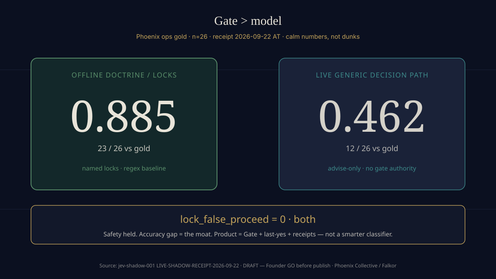

# Phoenix Gate Kit

> Thin policy gate for agent tool calls: **named locks · allow / deny / ask_human · receipts.**  
> Speaks Osmantic APE-shaped verify. Not another agent. Not a model SKU. Not a chat bus.

**Story arc:** DNA → Gate → packets → tenants  
**Horizon metaphor:** Galia as a fractal testing ground for agentic life — populate with receipts, never spray *(inspiration only; no partnership claim)*.

```
[0] Stack DNA (sacred)     SIOS · Continuity · Founder last-yes
[1] Gate Kit (this repo)   named locks · allow/deny/ask_human · receipts
[2] Ops packets            intent · bounds · won’t · AUTHORIZE
[3] Tenant faces           field faces on one spine (private)
```

---

## Why this exists

Agents will act. Someone has to gate irreversible acts **without killing speed**.

A gate that only denies is a **corpse**.  
A gate that always allows is a **wound**.  
DNA = named intents → `allow` / `require_approval` / `deny` **and** explicit allow paths so craft still lives.

**Intelligence should increase sovereignty, not diminish it.**  
Humans hold intent and last-yes. Agents execute. Every consequential act leaves provenance.

---

## Moat proof (calm)

On Phoenix ops gold (**n=26**, receipt-dated **2026-09-22 AT**):

| Judge | Accuracy | lock_false_proceed |
|-------|----------|--------------------|
| Offline doctrine / named locks | **0.885** (23/26) | **0** |
| Live generic decision model path | **0.462** (12/26) | **0** |

**Read:** the product is named locks + human last-yes + Continuity-shaped receipts — **not** a smarter classifier.  
Gold corpora stay private. Numbers are the shareable receipt. We don’t dunk on peers.

*(Optional methods footnote when asked: advise-only generic path; deterministic named-lock baseline; same gold; both kept lock safety at zero — accuracy is where doctrine won.)*

  


---

## What this is

- **Named locks** for irreversible acts (Publish, spend, wipe, invent-SKU, …)
- **Policy pack** shape: allow / deny / need-human (`ask_human` ↔ APE `require_approval`)
- **Receipt trail** agents and humans can cite (Continuity-shaped; no vault dump)
- **APE-shaped verify** vocabulary so peers can wire Hermes → policy without inventing a new religion
- **Offline adapter demo** pattern (mock APE + locks + receipts) — laptop-proven policy loop
- **Thin scope (Fork A)** — proof artifact, not an oxygen cathedral

### Vocabulary map (peer-shaped)

| Phoenix | APE `/verify` |
|---------|----------------|
| proceed | `allow` |
| block | `deny` |
| ask_human | `require_approval` → human approve |

---

## What this is NOT

| Not this | Why |
|----------|-----|
| Capture / SlipVault / contractor paper UX | Small-biz FDE face stays private; free seats ≠ OSS |
| Tenant auth / multi-tenant ledger / invoice parties | Selling the store |
| Continuity vault dumps / gold corpora | Trust ≠ dump; moat evidence stays closed |
| Hub / Content Hub / outbound SaaS | Hub-as-service starved — not a product in this narrative |
| “We replaced Hermes” / gym-Dojo software | Optional later fractal; not this face |
| A paid oxygen cathedral or smarter judge SKU | Money Eye: thin brick, not unpaid cathedral |

**Private fence (hard):** Capture factory · ledgers · tenant auth · Continuity vault / PII · wood / Starlink cash streams · Hub Make tokens · full SIOS tip dump.

---

## Quick start (when GO — shape only)

> Exact package layout lands with the public cut of `ods-phoenix-gate/adapter/`. Until then this section is **aspirational paste** for Founder review — do not claim a PyPI package that doesn’t exist.

```bash
# Example shape (Founder GO required before any public tree)
# python3 demo_loop.py
# → ALLOW / DENY / NEED_HUMAN lines + Continuity-shaped receipt JSONL
```

**Honest ceiling:** offline policy loop is proven craft. Live Hermes wire-up / production APE strength / Founder click in the wild = residuals. Humans remain the last story. Seam choice (hooks vs proxy vs in-Hermes) belongs with the peer who owns the gateway.

---

## Doctrine metabolism (public-safe)

| Intent class | Default | Allow path |
|--------------|---------|------------|
| Local craft (read / draft / analyze / plan) | **ALLOW** | Benign allowlist — livelihood |
| Speak in public / Publish | **NEED_HUMAN** | Founder approve · fingerprint · TTL |
| Spend / turn live scenario On / shell-risk | **NEED_HUMAN** | Founder last-yes |
| Wipe / invent SKU / exfil | **DENY** | none — fail-closed |

Anti-paralysis craft: every new hard deny needs a paired allow story; gate **acts**, not English morality on draft notes; false-positive NEED_HUMAN burns Founder attention — don’t flood via prose.

---

## Field proof (small biz FDE — no private UX)

We run the **same spine** in the dirt for small business: hold before send, named last-yes, receipts you can cite.  
Public desks and Capture seats are **field deployment for small business** — quiet proof the doctrine works — **not** the README hero and **not** open-sourced here.

If you need help on the ground (Valley Maps / GBP listing fix, Capture seat ask), see the Collective site soft footer when live — not this repo’s issues as a sales channel.

---

## Interest (soft)

Want the thin Gate Kit when the public tree lands? Leave a quiet note via the Collective site waitlist (when GO) — **pattern + receipts, not another chat bus.** No Hub seats pitch. No spray.

---

## Status

Draft / early. **Founder last-yes** on anything irreversible — including how we talk about this repo.  
Sequence lock for Phoenix public face: **Git → Collective site → LinkedIn** (this README is the Git face).

## License

Apache-2.0 *(if Founder GO)* · contributions: talk first · no drive-by cathedral PRs

## Links (fill only after those GOs)

- Phoenix Collective — philosophy page *(after site GO)*  
- Falkor X — guild story *(after bio GO)*  
- Scorecard / DNA → Gate → packets diagram — Collective assets when mirrored  

---

*Heart cathedral · guild energy · invisible founder · Money Eye · no hype BS.*  
*Populate, don’t spray.*
